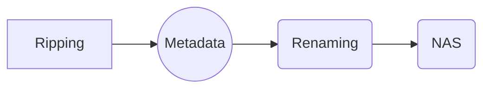

---
permalink: /metadata/
title: "Metadata"
excerpt: "Some various software used for organizing media files"

tags:
  - metadata
  - software
---

# MetaData Made Easy
Streaming Netflix or Spotify is nice, but I had a ton of old CDs, DVDs and every other format that's fallen out of favor. Rather than bin all of it, I ripped all out of it and threw it on a NAS. And then figuring out how to organize it.

## Movies and TV

[MakeMKV](http://www.makemkv.com/) - BluRay and DVD ripper, free while in beta
[Media Center Master](https://www.mediacentermaster.com/) - Metadata lookup utility

Ripping DVDs or Blu-Rays doesn't have the best reputation, but it's legal and these were the least sketchy options I could find. Rip the movies with [MakeMKV](http://www.makemkv.com/) , dump them in a folder on the NAS, run [Media Center Master](https://www.mediacentermaster.com/) on it and view it with [Kodi](https://kodi.tv/). [Media Center Master](https://www.mediacentermaster.com/) works better with movies than with TV shows and can do bulk renaming.  You can tag shows or movies with [IMDB](https://www.imdb.com/) info, which is quite handy. I do like tagging the movies with their IMDB score so I can find the absolutely worst movies in my collection. 

## Music

[Picard](https://picard.musicbrainz.org/) - MP3 automatic tagging
[MP3Tag](http://www.mp3tag.de/en/) - MP3 manual tagging

[MusicBrainz Picard](https://picard.musicbrainz.org/)  is great for doing your initial run. It can scan the audio directly and use the fingerprint to guess the song. It then can download the lyrics, cover art and all the other info. It normally will handle about 95% of all the songs perfectly. It can do bulk renaming.

[MP3TAG](http://www.mp3tag.de/en/)  is what you use when Picard can't figure out what a song is. Or if you want to add info to music you've created and recorded. It's been around for quite a few years. It's simple but has everything you could need.

## eBooks

[calibre](https://calibre-ebook.com/) - Currently best ebook manager

Calibre is quite good, and a bit weird. It's definitely tailored to the tastes of the programmer. It's good for maybe 80% of ebooks. New and popular, it can handle quite well. It can draw metadata from many sources, but Amazon is definitely the best. 
